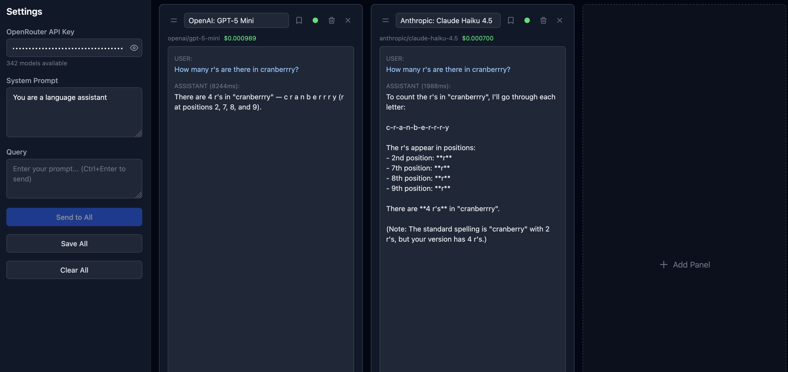

# Multichat — LLM Comparison Tool

A web application that lets users compare LLM outputs side-by-side by selecting multiple models from OpenRouter, entering a shared system prompt and query, and viewing each model's response in its own panel.

https://multichat-rose.vercel.app/



## Features

- Compare multiple LLM models side-by-side
- Searchable model selector powered by OpenRouter's model list
- Shared system prompt across all panels
- Drag-and-drop panel reordering with pin-to-left support
- Per-panel active/inactive toggle (inactive panels skip queries)
- Cost tracking per panel (from OpenRouter API usage data)
- Response latency display for each assistant message
- Save All conversations to JSON (exports all panels with messages and costs)
- Clear All conversations with one click
- Parallel request dispatch — if one model fails, others continue

## Getting Started
To run locally

```bash
npm install
npm run dev
```

Open [http://localhost:3000](http://localhost:3000) and enter your [OpenRouter API key](https://openrouter.ai/keys) to get started.

Note: In-memory state — refreshing the page resets the app

## Tech Stack

- Next.js 16 (App Router) with React 19
- TypeScript (strict mode)
- Tailwind CSS 4
- Zustand 5 for state management
- @dnd-kit for drag-and-drop

Built with Claude.